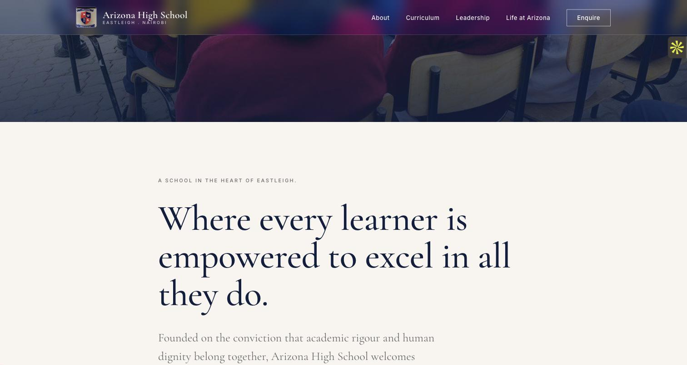
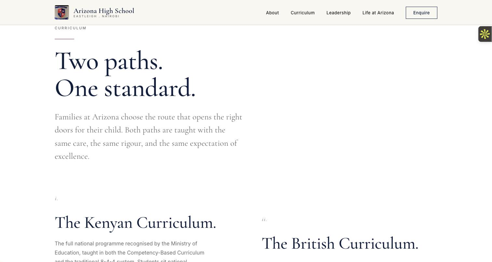

# Arizona High School

A hand-coded website for a co-educational day school in Eastleigh, Nairobi, Kenya.

**Live: [arizonahigh.co.ke](https://arizonahigh.co.ke)**

Built and delivered by [TheJamah](https://thejamah.com).

---

## The brief

The school teaches two curricula side by side, the British IGCSE Edexcel programme and the Kenyan national curriculum, and needed a site that presented both as equal paths rather than one as an afterthought. It also needed to run at effectively zero cost, and to be fully owned and operable by the school after handover, without a developer on retainer.

## What we built

A single-page site with anchored sections for About, Curriculum, Leadership and Life at Arizona, and an enquiry route for admissions.

The design leads with typography rather than decoration. Cormorant Garamond at display sizes carries the tone a school wants, formal without being stiff, and Inter keeps the body text plain and readable on the low-end Android phones most families here browse on.

The curriculum section was the core design problem. Two programmes, presented in parallel columns under one heading, so neither reads as the lesser option.

## Stack

| | |
|---|---|
| Build | Hand-coded static HTML and CSS. No framework, no build step |
| Hosting | Cloudflare Pages, free tier |
| SSL | Free, automatic, self-renewing |
| Domain | `.co.ke`, registered through a KENIC-accredited Kenyan registrar |
| Ongoing cost | **Zero.** Hosting and SSL are free permanently. Only the domain renews |

Static and framework-free was a deliberate choice, not a shortcut. The site has no dependencies to patch, nothing to rebuild, and nothing that breaks when a package updates two years from now. A school with no technical staff should not inherit a maintenance burden.

## Brand

| | |
|---|---|
| Navy | `#0F1E3D` |
| Burgundy | `#6B1F2A` |
| Ivory | `#F8F5EF` |
| Headline | Cormorant Garamond |
| Body | Inter |

## Screenshots

## Outcome

Live on the school's own domain, on the school's own hosting account, with SSL. Delivered alongside a written owner's guide covering where everything lives, what renews and when, how to request changes, and what never to touch. The school owns the domain, the hosting and the content outright.

## A note on the source

The source repository is private and stays that way. The site carries photographs of identifiable students and staff, and the handover document holds the school's contact and payment details. Publishing either would be the school's decision to make, not ours, and Kenya's Data Protection Act 2019 applies.

The screenshots above were taken from the live public site and deliberately avoid identifiable faces.

---

Want something similar? [thejamah.com](https://thejamah.com)
